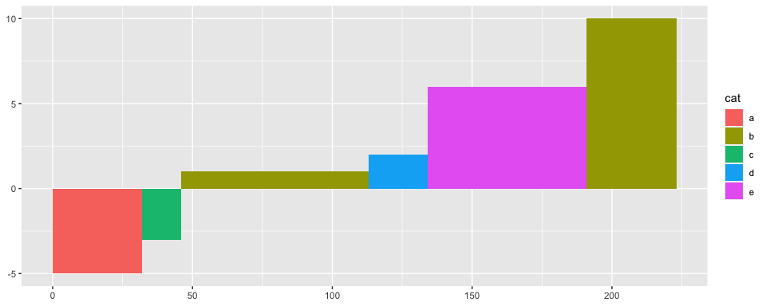

ggmacc
================
Dr Alasdair Sykes
16/11/2020

#### *Easy, stylish marginal abatement cost curves with ggplot2*

Marginal abatement cost curves (MACCs) are a data visualisation and
decision tool used in the economic analysis of pollution (typically
greenhouse gas emissions) abatement. A MACC is an easy-to-read
visualisation of a series of mitigation measures vs. a baseline (usually
business-as-usual) contextualised by economic cost.

In pure data visualisation terms, MACCs are a little special and so most
off-the-shelf graphing packages (e.g. MS Excel) struggle to produce
them. This small and simple package brings together a group of functions
which make use of the `ggplot2` environment (and specifically
`geom_rect`) to draw simple, clear and attractive MACCs with the minimum
of fuss for the user.

This package was imagined and written by Dr Alasdair Sykes
([@alasdair\_sykes](https://twitter.com/alasdair_sykes)).

## Installation

This package is hosted on Github and can be installed using the
`devtools` package:

``` r
# install.packages("devtools")
devtools::install_github("aj-sykes92/ggmacc")
```

> Note: If this doesn’t work, update `devtools`, as Github recently
> changed the term it uses for the primary version of a source code
> repository.

## Usage — `ggmacc`

This package is comprised of three functions; one (`macc_prep`) for
preparation of a raw dataset for plotting, one (`geom_macc`) for adding
the MACC geom to a `ggplot` object, and one (`ggmacc`) which brings
these together with other functional elements for an ‘out-of-the-box’
marginal abatement cost curve plot.

The package also contains two datasets; a small, fiction dataset
(`small_example`) for demo purposes, and a larger dataset based on real
analysis (`uk_agroforestry`).

The `ggmacc` function provides a fully developed ggplot-based MACC plot
with all the trimmings:

``` r
social_cost_of_carbon <- 66.1

full_macc <- uk_agroforestry %>%
  ggmacc(abatement = co2_tyear, mac = mac_gbp_tco2, fill = crop, cost_threshold = social_cost_of_carbon,
         zero_line = TRUE, threshold_line = TRUE, threshold_fade = 0.3)

full_macc
```


I’ve avoided replicating any ggplot2 functionality unnecessarily.
However, the output is a `ggplot` object, so refinements can be added
with the usual syntax:

``` r
full_macc +
  scale_x_continuous(labels = scales::number_format()) +
  scale_fill_manual(values = Manu::get_pal("Kea")) +
  labs(title = "Marginal abatement cost curve for UK agroforestry",
       fill = "Crop type",
       x = expression("Abatement (tonnes CO"[2]*"-eq)"),
       y = expression("Marginal abatement cost (GBP tonne CO"[2]*"-eq"^{-1}*")")
       ) +
  theme_classic()
```


\> Thanks to the very cool `Manu` package for providing this colour
palette — find it at <https://github.com/G-Thomson/Manu>.

## Usage — base functions

The two base functions wrapped in `ggmacc` have been designed to work
with a typical `tidyverse` workflow and use tidy evaluation. They are
made available to allow the user to fully manipulate the basic elements
of this package. Pipe data into `macc_prep` and identify the variables
which characterise abatement and cost; pipe into `ggplot` and add
`geom_macc` to the result. `geom_macc` also takes a fill argument:

``` r
small_example %>%
  macc_prep(mac = mac, abatement = abatement) %>%
  ggplot() +
  geom_macc(fill = cat)
```



This can be augmented and refined in the same way as any other `ggplot`
object. This disaggregated syntax also allows the user opportunity to
modify the base data following `macc_prep` if desired.

## Acknowledgements

Thanks to Defra and the Natural Environment Research Council for
providing projects and questions which led to the original development
of the code in this package. The package is based around `tidyverse`
ideas and functions, so thanks go also to Hadley Wickham and the
tidyverse team for building and maintaining this incredible environment.

## Contribute

If you would like to contribute to this package, please file an issue,
make a pull request on GitHub, or contact the author on Twitter
[@alasdair\_sykes](https://twitter.com/alasdair_sykes).
